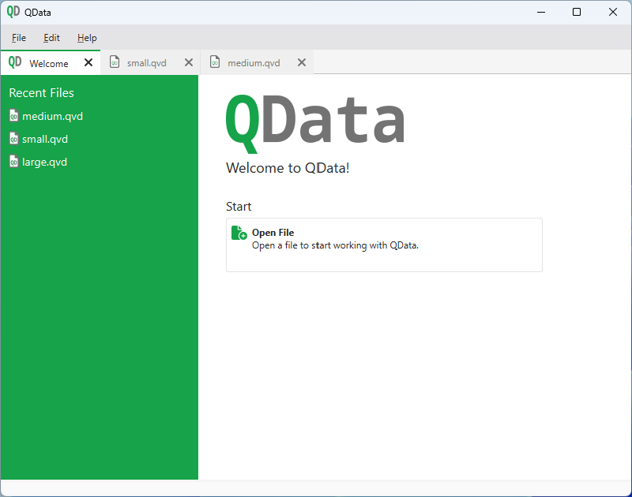
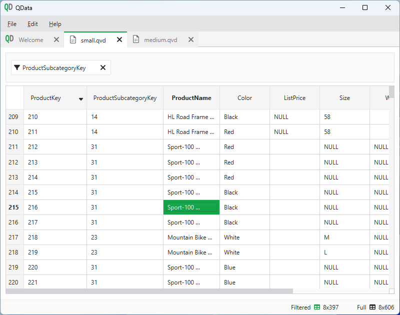

# QData

> QData is a simple reader/writer for Qlik View/Sense data (QVD) files.

---

- [Introduction](#introduction)
- [License](#license)
  - [Forbidden](#forbidden)

---

## Introduction

QData is a desktop application for viewing and editing files in the proprietary
Qlik View Data (QVD) format. The application is written in Python and uses the
[PyQvd](https://github.com/MuellerConstantin/PyQvd) library to process QVD files
internally. The application allows you to view the contents of a QVD file, edit
the data, and save the changes back to the file. This enables BI developers to
view and edit QVD files without having to load them into Qlik Sense/Qlik View.

  
  

With QData you can: Analyze the structure of a QVD file, view the data in a
structured table, edit the data in the table, and save the changes back to the
file. The application is designed to be simple and easy to use, with a clean
interface that makes it easy to navigate and use. With just a few clicks you
can search for missing values and duplicates. Filters can be applied to the
data and the data can be sorted based on individual values. Furthermore, you
can also search for values and much more.

## License

Copyright (c) 2024 Constantin Müller

Permission is hereby granted, free of charge, to any person obtaining a copy
of this software and associated documentation files (the "Software"), to deal
in the Software without restriction, including without limitation the rights
to use, copy, modify, merge, publish, distribute, sublicense, and/or sell
copies of the Software, and to permit persons to whom the Software is
furnished to do so, subject to the following conditions:

The above copyright notice and this permission notice shall be included in all
copies or substantial portions of the Software.

THE SOFTWARE IS PROVIDED "AS IS", WITHOUT WARRANTY OF ANY KIND, EXPRESS OR
IMPLIED, INCLUDING BUT NOT LIMITED TO THE WARRANTIES OF MERCHANTABILITY,
FITNESS FOR A PARTICULAR PURPOSE AND NONINFRINGEMENT. IN NO EVENT SHALL THE
AUTHORS OR COPYRIGHT HOLDERS BE LIABLE FOR ANY CLAIM, DAMAGES OR OTHER
LIABILITY, WHETHER IN AN ACTION OF CONTRACT, TORT OR OTHERWISE, ARISING FROM,
OUT OF OR IN CONNECTION WITH THE SOFTWARE OR THE USE OR OTHER DEALINGS IN THE
SOFTWARE.

[MIT License](https://opensource.org/licenses/MIT) or [LICENSE](LICENSE) for
more details.

### Forbidden

**Hold Liable**: Software is provided without warranty and the software
author/license owner cannot be held liable for damages.
